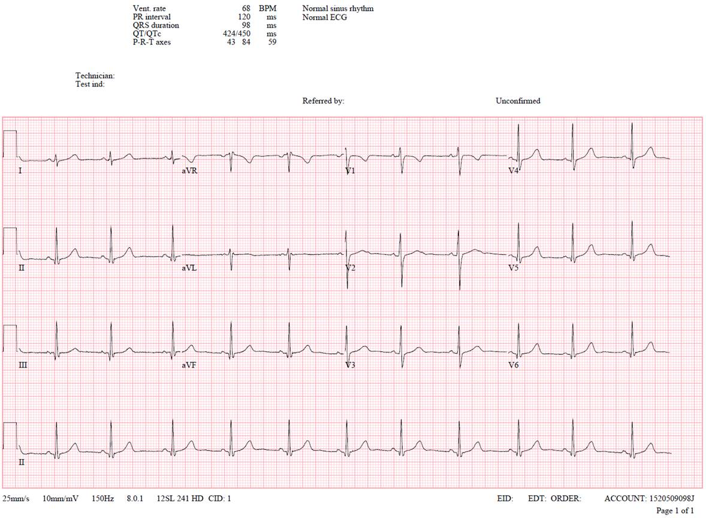
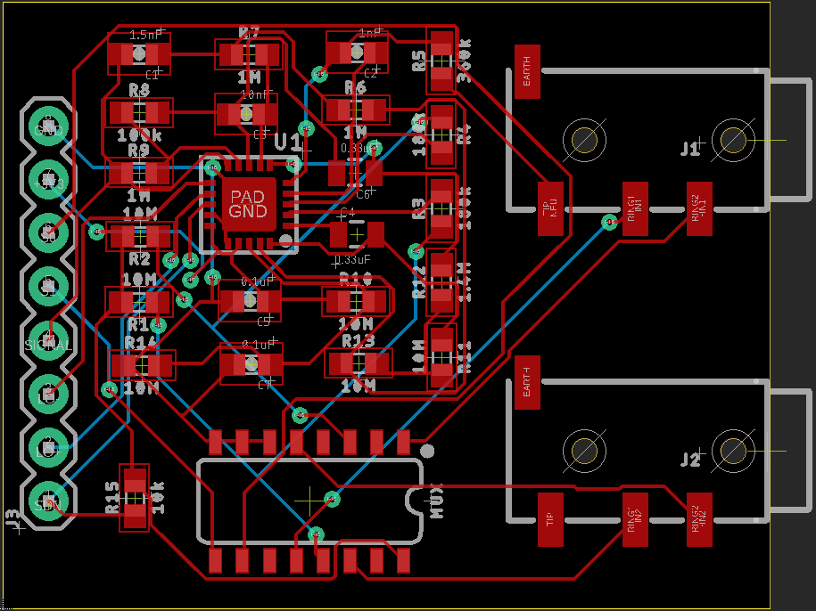
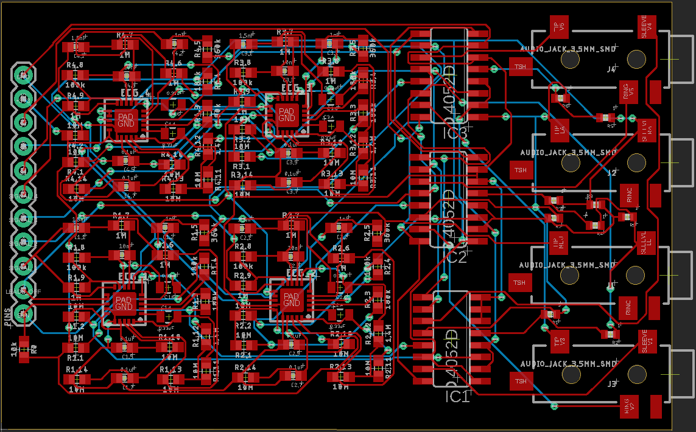

# ecg_pcb_designs

This repo contains the EAGLE files for the PCB design of a prototype double-lead ECG filter and amplifier as well as the final product: a compact 12-lead ECG filter and amplifier that has maximum dimensions of 70mm by 50mm. The pins S0 and S1 control the multiplexer that switches the input signal to the ECG monitor such that a ECG which comprises of 3 rows of 4 leads (plus 1 row of Lead 2) can be generated.

Picture of a Standard ECG

Board Design For 2-Lead ECG

Board Design For 12-Lead ECG

